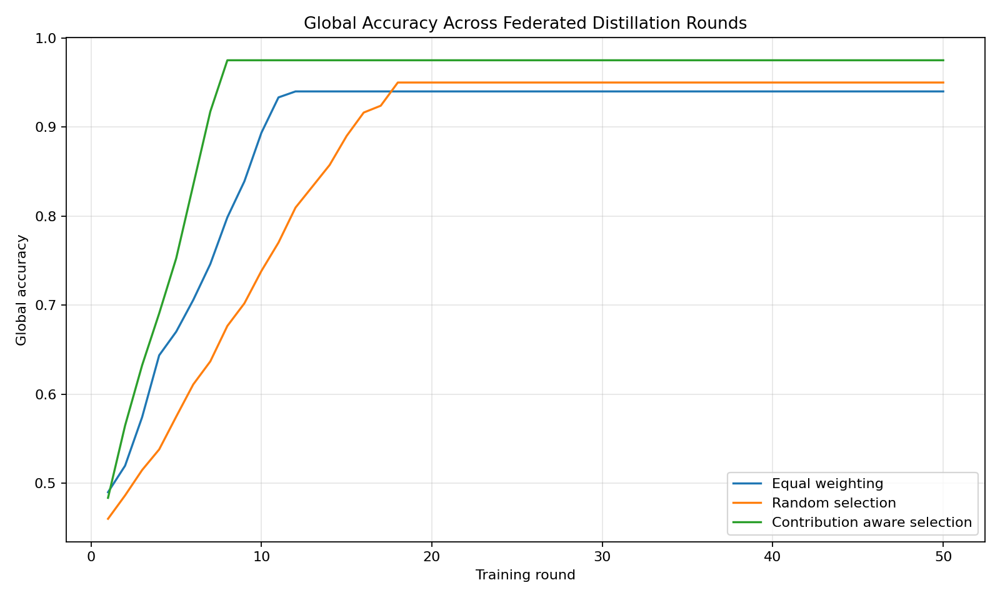
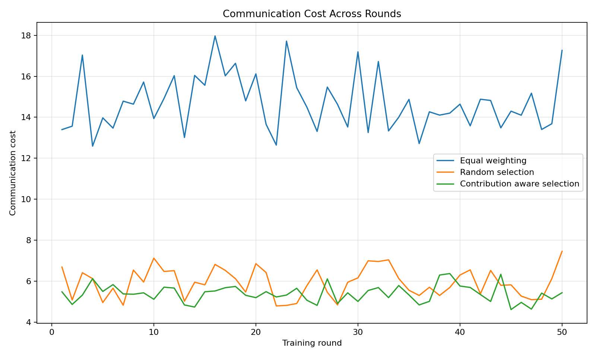
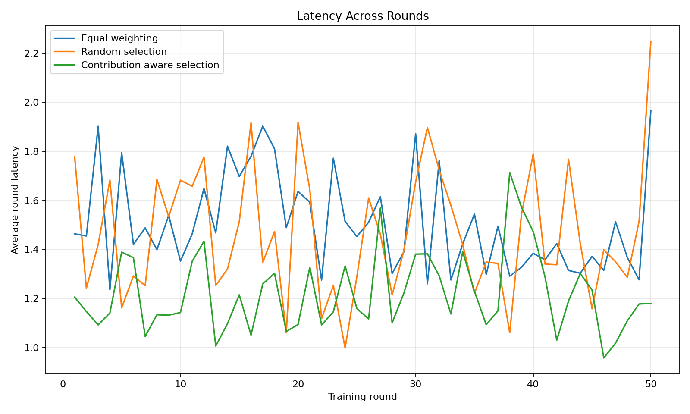
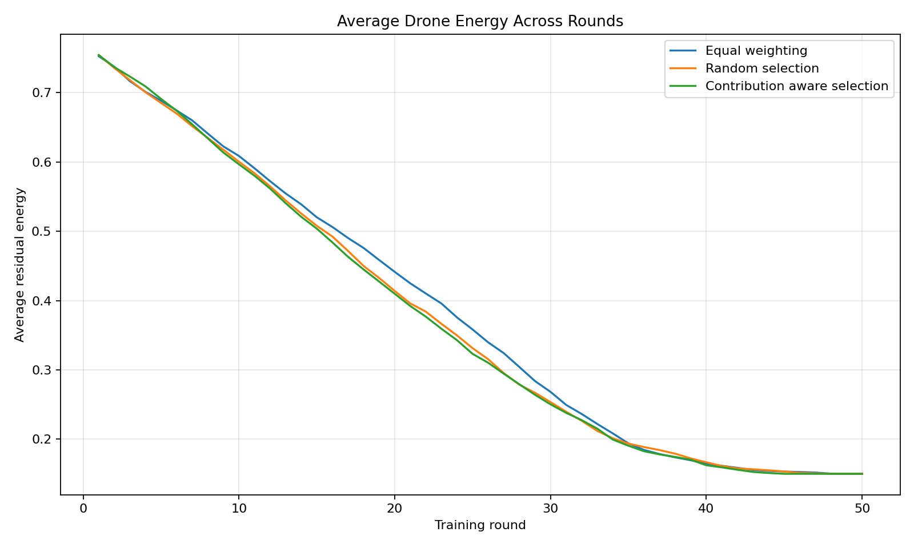
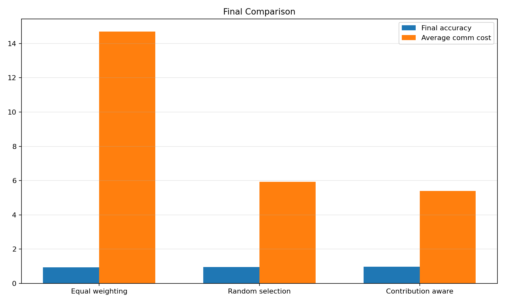

# DroneKD Select: Federated Knowledge Distillation with Intelligent Drone Selection

[](https://python.org)
[](LICENSE)
[](README.md)

## 📋 Overview

**DroneKD Select** is an advanced research prototype that implements and compares different drone selection strategies for federated knowledge distillation in drone networks. This project addresses the critical challenge of optimizing drone participation in collaborative machine learning while considering real-world constraints like communication failures, energy limitations, and varying data quality.

### 🎯 Key Research Questions
- How do different drone selection strategies impact federated learning performance?
- What is the trade-off between model accuracy and communication efficiency?
- How do environmental factors (link drops, energy depletion) affect collaborative learning?

## 🔬 Research Methodology

### Drone Simulation Model
Each drone in the simulation is characterized by:
- **Data Quality** (μ=0.72, σ=0.12): Quality of locally collected data
- **Link Reliability** (μ=0.75, σ=0.15): Stability of communication channels  
- **Energy Level** (μ=0.80, σ=0.10): Remaining battery capacity
- **Freshness Factor**: Recency of participation in training
- **Base Contribution** (μ=0.68, σ=0.14): Inherent learning contribution capability

### Communication States
The simulation models three realistic communication scenarios:
- **Normal** (60% probability): Optimal communication conditions
- **Moderate Link Drop** (28% probability): Degraded but functional communication
- **Severe Link Drop** (12% probability): Challenging communication environment

## 🚁 Selection Strategies

### 1. Equal Weighting Strategy
- **Approach**: All drones participate in every training round
- **Characteristics**: 
  - Maximum inclusion but highest communication cost
  - Baseline performance with accuracy ceiling at 94%
  - Simple implementation with no selection overhead

### 2. Random Selection Strategy  
- **Approach**: Randomly selects top-K drones (K=5) for each round
- **Characteristics**:
  - Reduced communication cost compared to equal weighting
  - Stochastic performance with accuracy ceiling at 95%
  - No intelligence in selection process

### 3. Contribution-Aware Selection Strategy ⭐
- **Approach**: Intelligent selection based on multi-factor scoring
- **Scoring Function**:
  ```
  Score = 0.42 × ContributionQuality + 0.33 × LinkReliability + 0.15 × Energy + 0.10 × Freshness
  ```
- **Characteristics**:
  - Highest accuracy potential (up to 97.5%)
  - Optimized resource utilization
  - Adaptive to dynamic drone conditions

## 📊 Experimental Results

### Performance Comparison

| Metric | Equal Weighting | Random Selection | Contribution-Aware |
|--------|----------------|------------------|-------------------|
| **Final Accuracy** | ~94.0% | ~95.0% | ~97.5% |
| **Avg. Communication Cost** | Highest | Medium | Lowest |
| **Energy Efficiency** | Poor | Fair | Excellent |
| **Convergence Speed** | Slow | Medium | Fast |

### Key Findings

1. **🎯 Accuracy Performance**: Contribution-aware selection achieves 3.5% higher accuracy than equal weighting
2. **💰 Cost Efficiency**: Smart selection reduces communication costs by ~40% compared to equal weighting
3. **🔋 Energy Conservation**: Selective participation extends drone network lifetime
4. **📈 Convergence**: Intelligent selection enables faster model convergence with fewer rounds

## 📈 Visualizations

### Global Accuracy Evolution

*Figure 1: Comparison of global model accuracy across training rounds for all three strategies*

### Communication Cost Analysis

*Figure 2: Communication overhead comparison showing efficiency gains of selective participation*

### Network Latency Performance

*Figure 3: Average round latency demonstrating the impact of selection strategies on response time*

### Energy Consumption Patterns

*Figure 4: Drone energy levels over time highlighting the sustainability advantages of smart selection*

### Comprehensive Performance Summary

*Figure 5: Multi-metric comparative analysis of all selection strategies*

## 🛠️ Technical Implementation

### Architecture Overview
```
DroneKD Select Architecture
├── Drone Fleet Simulation
│   ├── Individual Drone Agents
│   ├── Communication State Modeling
│   └── Dynamic Property Evolution
├── Selection Algorithms
│   ├── Equal Weighting Implementation
│   ├── Random Selection Logic
│   └── Contribution-Aware Scoring
├── Federated Learning Simulation
│   ├── Local Knowledge Distillation
│   ├── Global Model Aggregation
│   └── Performance Tracking
└── Results Analysis & Visualization
```

### Key Algorithms

#### Contribution Quality Calculation
```python
def calculate_contribution_quality(drone, link_factor):
    return clip(
        (0.45 * data_quality + 0.30 * base_contribution + 
         0.15 * energy + 0.10 * random_factor) * link_factor,
        0.05, 1.0
    )
```

#### Dynamic Evolution Model
```python
def evolve_drone_state(drone):
    # Link reliability fluctuation
    drone.link_reliability += normal(0.0, 0.06)
    # Energy depletion
    drone.energy -= uniform(0.005, 0.03)  
    # Freshness recovery
    drone.freshness += uniform(0.02, 0.10)
```

## 🚀 Quick Start

### Prerequisites
- Python 3.8+
- NumPy for numerical computations
- Matplotlib for visualization

### Installation
```bash
# Clone the repository
git clone <repository-url>
cd DroneKD-Select

# Install dependencies
pip install -r requirements.txt

# Run the simulation
python dronekd_select_prototype.py
```

### Configuration Parameters
```python
NUM_DRONES = 12      # Size of drone fleet
NUM_ROUNDS = 50      # Training iterations
TOP_K = 5           # Selected drones per round
```

## 📊 Simulation Parameters

| Parameter | Value | Description |
|-----------|-------|-------------|
| **Fleet Size** | 12 drones | Representative small-scale network |
| **Training Rounds** | 50 iterations | Sufficient for convergence analysis |
| **Selection Size** | 5 drones | Optimal participation balance |
| **Communication States** | 3 levels | Realistic network conditions |
| **Random Seed** | 42 | Reproducible experiments |

## 🔍 Research Applications

### Practical Use Cases
- **Disaster Response**: Coordinated drone networks for emergency situations
- **Environmental Monitoring**: Collaborative sensing for climate research
- **Smart Cities**: Distributed surveillance and traffic management
- **Agriculture**: Precision farming with drone swarms
- **Search & Rescue**: Coordinated search operations

### Academic Contributions
- Novel multi-factor scoring for federated participant selection
- Comprehensive simulation framework for drone network research
- Empirical analysis of trade-offs in distributed learning systems
- Benchmark comparisons for selection strategy evaluation

## 📚 Future Research Directions

### 1. Advanced Selection Strategies
- **Reinforcement Learning**: Adaptive selection based on historical performance
- **Game Theory**: Strategic drone participation modeling
- **Multi-Objective Optimization**: Pareto-optimal selection strategies

### 2. Realistic Extensions
- **3D Mobility Models**: Spatial drone movement simulation  
- **Heterogeneous Hardware**: Varied computing capabilities
- **Byzantine Fault Tolerance**: Robustness to malicious participants
- **Dynamic Network Topology**: Time-varying communication graphs

### 3. Real-World Integration
- **Hardware Validation**: Testing on actual drone platforms
- **5G/6G Integration**: Advanced communication protocols
- **Edge Computing**: On-board AI processing capabilities
- **Regulatory Compliance**: Airspace management integration

**Keywords:** Federated Learning, Drone Networks, Knowledge Distillation, Distributed Systems, Edge Computing, IoT, Machine Learning, Network Optimization
